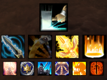
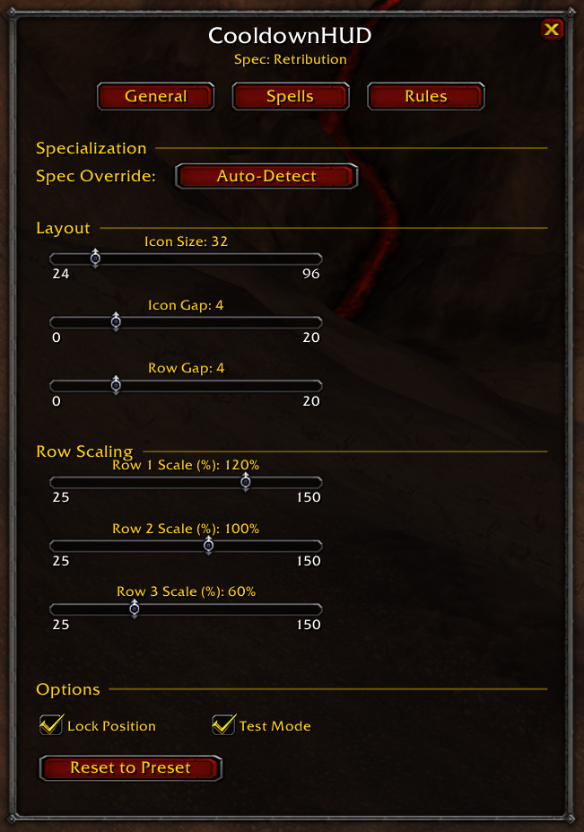
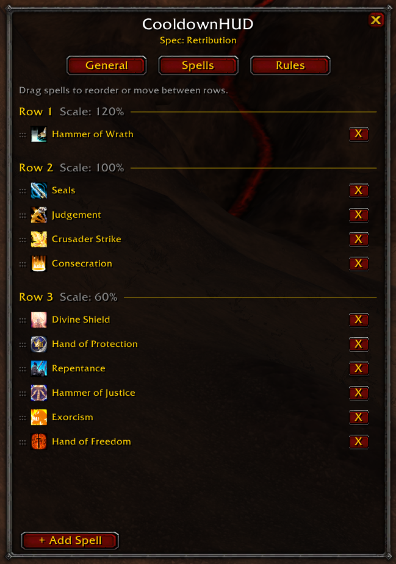
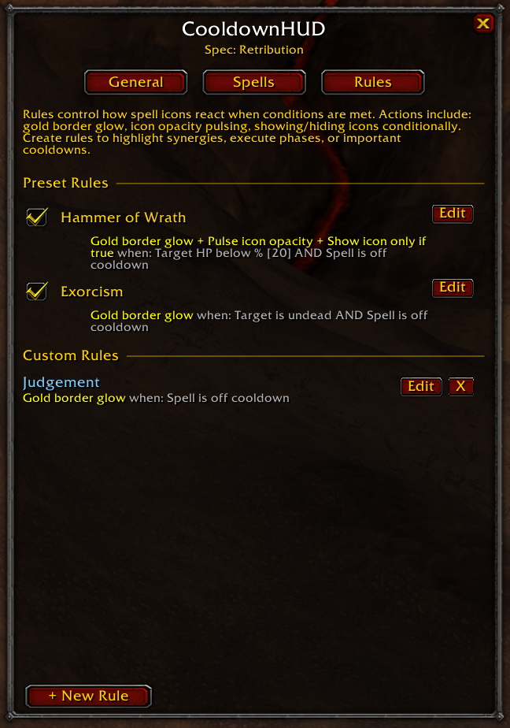
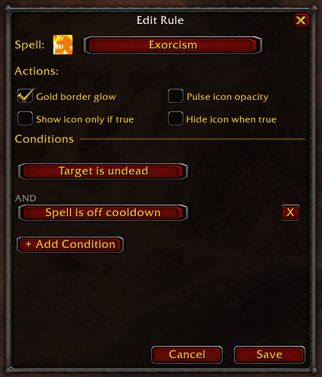
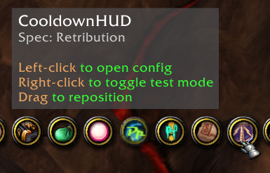

# CooldownHUD

A modular cooldown tracking HUD addon for **TurtleWoW** (WoW 1.12 / Interface 11200).

## Features

### Cooldown Tracking
- Track any spell from your spellbook across up to 3 configurable rows
- Cooldown sweep animation (top-to-bottom reveal as cooldown expires)
- Red countdown timer scaled to icon size
- Seal tracker with white duration timer and pulse alert when no seal is active
- Greyscale Judgement icon when no seal is active

### Rule System
- Create conditional rules that trigger actions on spell icons
- **Actions**: Gold border glow, Pulse icon opacity, Show icon only if true, Hide icon when true
- **Conditions** (up to 3 per rule, AND logic):
  - Spell is off cooldown
  - Player has buff / Player missing buff
  - Target HP below %
  - Player HP below %
  - Player mana below %
  - In combat
  - Has attackable target
  - Target is undead
- Preset rules included for Paladin (Retribution, Protection, Holy)
- Custom rules with full editor UI

### Configuration Panel
- **General tab**: Spec override, icon size/gap/row gap sliders, per-row scaling, lock position, test mode
- **Spells tab**: Drag-and-drop reordering within and between rows, one-click removal
- **Rules tab**: Enable/disable preset rules with checkboxes, create/edit/delete custom rules
- Section headers, tooltips, and spell icon previews throughout
- Minimap button (left-click config, right-click test mode, drag to reposition)

### Layout
- Up to 3 rows of icons with independent scaling (25-150%)
- Draggable HUD positioning (lockable)
- Test mode shows all icons for easy layout adjustment

## Screenshots

### HUD In Action

*Three rows of cooldown icons with sweep animation, timers, and glow alerts*

### Configuration - General

*Spec override, layout sliders, row scaling, lock/test mode checkboxes*

### Configuration - Spells

*Drag-and-drop spell reordering across rows*

### Configuration - Rules

*Preset and custom rules with enable/disable checkboxes*

### Rule Editor

*Spell icon preview, action checkboxes, and condition builder*

### Minimap Button

*Left-click for config, right-click for test mode, drag to reposition*

## Installation

1. Download or clone this repository
2. Copy the `CooldownHUD` folder to `<WoW Directory>/Interface/Addons/`
3. Restart WoW or type `/console reloadui`

## Usage

- `/cooldownhud` or `/chud` - Toggle the configuration panel
- Left-click the minimap button to open config
- Right-click the minimap button to toggle test mode

## Class Support

Includes presets for all 9 classes with spec-specific spell layouts and alert rules:

- **Paladin** — Retribution, Protection, Holy (+ Seal Tracker)
- **Druid** — Balance, Feral, Restoration
- **Warrior** — Arms, Fury, Protection (+ TurtleWoW Spell Reflection)
- **Mage** — Arcane, Fire, Frost
- **Warlock** — Affliction, Demonology, Destruction (+ TurtleWoW Dark Harvest, Shadowfury)
- **Priest** — Discipline, Holy, Shadow (+ TurtleWoW Pain Spike)
- **Rogue** — Assassination, Combat, Subtlety (+ TurtleWoW Blade Flurry for all specs)
- **Hunter** — Beast Mastery, Marksmanship, Survival (+ TurtleWoW Steady Shot)
- **Shaman** — Elemental, Enhancement, Restoration (+ TurtleWoW Bloodlust, Spirit Link, Feral Spirit, Hex)

Spells the player doesn't have (unlearned talents, wrong race) are automatically hidden.

## Requirements

- TurtleWoW (WoW 1.12 client, Interface 11200)
- Lua 5.0 compatible (no Lua 5.1 features)

## License

MIT
